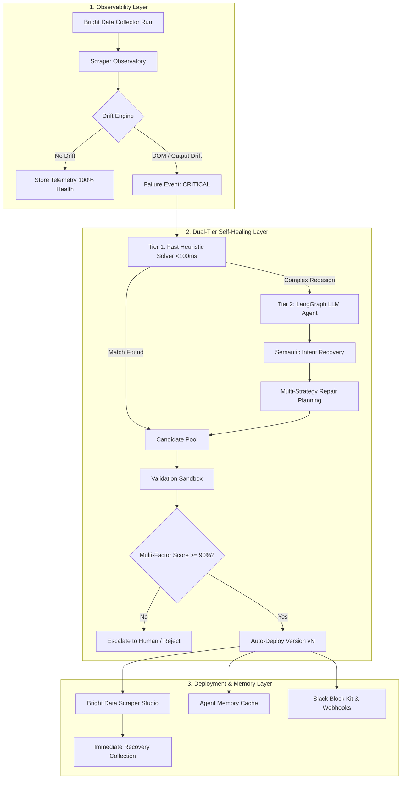

<div align="center">

# 🛡️ WebGuardian AI
### *The Autonomous AI Reliability Engineer for Web Data Pipelines*

[](https://python.org)
[](https://fastapi.tiangolo.com)
[](https://langchain-ai.github.io/langgraph/)
[](https://nextjs.org)
[](https://www.typescriptlang.org)
[](https://tailwindcss.com)
[-success.svg)](https://github.com/Rajtiwari0202/WebGuardian)
[](LICENSE)

<p align="center">
  <strong>"Observe → Understand → Repair → Validate → Deploy → Learn"</strong><br>
  <em>AI proposes. The Sandbox proves. WebGuardian deploys.</em>
</p>

</div>

---

## 📑 Table of Contents
- [Executive Overview](#-executive-overview)
- [The Core Problem](#-the-core-problem)
- [System Architecture (3-Layer Hierarchy)](#-system-architecture)
- [Core Innovation & Key Features](#-core-innovation--key-features)
- [Software Design Patterns](#-software-design-patterns)
- [60-Second Quickstart Guide](#-60-second-quickstart-guide)
- [Deterministic Demo & Judge Scenarios](#-deterministic-demo--judge-scenarios)
- [Quality Gates & Test Telemetry](#-quality-gates--test-telemetry)
- [Environment Configuration](#-environment-configuration)
- [Repository Structure](#-repository-structure)
- [Documentation Index](#-documentation-index)

---

## 💡 Executive Overview

Modern enterprises depend on web data for competitive pricing, documentation audits, market intelligence, and inventory tracking. However, **websites change constantly**, silently breaking scrapers, zeroing out datasets, and forcing engineers to waste hours debugging DOM trees.

**WebGuardian AI** sits directly on top of data collection infrastructure (**Bright Data Scraper Studio**) as an autonomous reliability layer. When a scraper experiences quality or DOM drift, WebGuardian's **Dual-Tier Self-Healing Engine** automatically identifies the root cause, synthesizes repair strategies, tests them in an isolated **Validation Sandbox**, and deploys healed selector updates without downtime.

```text
┌────────────────────────────────────────────────────────┐
│             WEBGUARDIAN AI (CONTROL PLANE)             │
│  - Observes Quality, Schema & DOM Drift                │
│  - Tier 1: Fast AST Heuristics (<100ms, $0 cost)       │
│  - Tier 2: Stateful LangGraph LLM Agent (Gemini/OpenAI)│
│  - Validation Sandbox (Multi-Factor Scoring)           │
│  - Agent Memory (Caches high-confidence fixes)         │
└───────────────────────────┬────────────────────────────┘
                            │ (Auto-Deploys Healed Selectors)
                            ▼
┌────────────────────────────────────────────────────────┐
│               BRIGHT DATA SCRAPER STUDIO               │
│            (Data Collection Infrastructure)            │
│  - High-concurrency rotating residential proxies       │
│  - Fully managed browser unblocking & CAPTCHA bypass   │
│  - Zero-maintenance distributed dataset extraction     │
└────────────────────────────────────────────────────────┘
```

---

## 🛑 The Core Problem

| Failure Mode | Traditional Scraper Impact | WebGuardian AI Autonomous Solution |
| :--- | :--- | :--- |
| **DOM Class Shift** | Silently returns `0` rows; downstream pipelines ingest empty data. | **Tier 1 Heuristic Engine** detects attribute shift & deploys replacement in $<100$ms. |
| **Website Layout Redesign** | Engineer spends 3–6 hours inspecting DOM and writing new selectors. | **LangGraph Agent** performs semantic intent recovery & repairs pipeline autonomously. |
| **Proxy / Latency Drop** | Job times out and marks batch as corrupted. | **Drift Engine** isolates runtime anomalies and adjusts concurrency limits. |
| **Unsafe AI Repairs** | Naive LLM generates hallucinated selector that extracts incorrect data. | **Validation Sandbox** enforces multi-factor scoring formula, rejecting candidates $<90\%$. |

---

## 🏗️ System Architecture



---

## 🌟 Core Innovation & Key Features

### 1. ⚡ Dual-Tier Self-Healing Engine
* **Tier 1: Fast AST Heuristics**: Solves 70%+ of DOM redesigns (such as `.price` migrating to `[data-testid='price']` or `.product-price`) in **<50ms with $0.00 token cost**.
* **Tier 2: LangGraph Reasoning**: For major layout overhauls, orchestrates a stateful multi-step AI workflow (Intent Recovery $\rightarrow$ Strategy Synthesis $\rightarrow$ DOM Verification).

### 2. 🧪 Safety Validation Sandbox
AI candidates are never deployed blind. Every candidate is evaluated against strict schema contracts using our multi-factor formula:
$$\text{Final Score} = 30\% \text{ Semantic Match} + 30\% \text{ Coverage} + 20\% \text{ Schema Validity} + 10\% \text{ Structural Similarity} + 10\% \text{ Confidence}$$
* **Threshold $\ge 90\%$**: Deployed automatically.
* **Threshold $< 90\%$**: Blocked by safety guardrails and flagged for human review.

### 3. 🧠 Agent Memory
Solved repairs are cached into persistent relational memory (`AgentMemory`). When a recurring layout change occurs, WebGuardian recalls the solution with a 99%+ confidence boost.

### 4. 🚨 Real-Time Incident War Room (`/incidents/[id]`)
Streams live execution telemetry over **Server-Sent Events (SSE)**, contrasting Old Failed Selectors with Deployed Selectors alongside candidate audit matrices.

### 5. 🏢 Multi-Tenancy & Enterprise Integrations (`/settings`)
* Organization quotas & seat management.
* **Slack Block Kit** interactive incident alerts.
* Outbound HMAC-SHA256 signed webhooks for Datadog and custom data pipelines.
* Developer API key generator (`wg_live_...`).

---

## 🏛️ Software Design Patterns

WebGuardian AI adheres to classical software design patterns (see [`docs/DESIGN_PATTERNS.md`](docs/DESIGN_PATTERNS.md)):
1. **Strategy Pattern**: Encapsulates selector synthesis algorithms (`AttributeMatch`, `StructuralMatch`, `SemanticProximity`, `MemoryRecall`).
2. **Factory Method Pattern**: Hot-swappable providers for LLMs (`GeminiProvider`, `OpenAIProvider`, `MockProvider`) and Scraping Infrastructure (`RealBrightDataService`, `MockBrightDataService`).
3. **Finite State Machine Pattern**: LangGraph typed state transitions (`AgentState`).
4. **Observer / Pub-Sub Pattern**: Thread-safe `EventBroker` for SSE streams.
5. **Circuit Breaker / Fallback Pattern**: Tier 1 Heuristics $\rightarrow$ Tier 2 LLM $\rightarrow$ Deterministic Sandbox.
6. **Repository Pattern**: Clean data access abstraction via SQLAlchemy 2.0.

---

## ⚡ 60-Second Quickstart Guide

### 1. Clone & Setup
```bash
git clone https://github.com/Rajtiwari0202/WebGuardian.git
cd WebGuardian
```

### 2. Launch FastAPI Backend
```bash
# Windows PowerShell
.\venv\Scripts\activate
# Linux / macOS: source venv/bin/activate

python -m uvicorn apps.backend.app.main:app --reload
```
*Backend API running at `http://127.0.0.1:8000` (Swagger UI at `/docs`)*

### 3. Launch Next.js Frontend
```bash
cd apps/frontend
npm install
npm run dev
```
*Frontend Console running at `http://localhost:3000/dashboard`*

---

## 🎯 Deterministic Demo & Judge Scenarios

To demonstrate real-time autonomous self-healing for hackathon judges:

1. Open **`http://localhost:3000/dashboard`**.
2. Ensure **Judge Mode** is toggled **ON** in the top bar.
3. Click any scenario button:
   * **`DOM Drift`**: Simulates website structure change. Automatically redirects to the **Incident War Room** where you watch the agent heal the pipeline in real time.
   * **`Outage Timeout`**: Simulates proxy timeout and demonstrates runtime resilience.
   * **`Unsafe Rejections`**: Demonstrates the **Validation Sandbox** rejecting low-scoring candidate selectors.
   * **`Reset Demo Environment`**: Restores baseline database state with 1 click.

---

## 🧪 Quality Gates & Test Telemetry

All 7 unit and integration test suites pass with **100% score**:

```bash
.\venv\Scripts\pytest.exe tests/ -v
```

```text
tests/integration/test_bright_data.py::test_collector_creation_and_async_run[asyncio] PASSED [ 14%]
tests/integration/test_bright_data.py::test_real_service_timeout_handling[asyncio]     PASSED [ 28%]
tests/integration/test_enterprise.py::test_tenant_creation_and_api_keys              PASSED [ 42%]
tests/integration/test_enterprise.py::test_slack_alerting_formatter                 PASSED [ 57%]
tests/integration/test_self_healing.py::test_self_healing_after_dom_change            PASSED [ 71%]
tests/unit/test_fast_heuristics.py::test_data_testid_migration                        PASSED [ 85%]
tests/unit/test_fast_heuristics.py::test_class_alias_migration                       PASSED [100%]

======================= 7 passed in 9.69s =======================
```

---

## ⚙️ Environment Configuration

WebGuardian AI operates in **Zero-Config Simulation Mode** by default. To connect live external services, populate `.env`:

| Variable | Default | Description |
| :--- | :--- | :--- |
| `LLM_PROVIDER` | `mock` | `gemini`, `openai`, or `mock` |
| `GEMINI_API_KEY` | *(Optional)* | Google Gemini 1.5 Flash/Pro API Key |
| `OPENAI_API_KEY` | *(Optional)* | OpenAI GPT-4o API Key |
| `BRIGHT_DATA_API_KEY` | *(Optional)* | Bright Data Scraper Studio API Token |
| `BRIGHT_DATA_CUSTOMER_ID` | *(Optional)* | Bright Data Account Customer ID |
| `DATABASE_URL` | `sqlite:///./webguardian.db` | PostgreSQL or SQLite connection string |

---

## 📂 Repository Structure

```text
WebGuardian/
├── apps/
│   ├── ai_agent/                 # LangGraph Autonomous Self-Healing Graph
│   │   └── graph.py              # State machine nodes & transition edges
│   │
│   ├── backend/                  # FastAPI Control Plane & Observatory
│   │   ├── app/
│   │   │   ├── core/             # Configuration, Database Session, Settings
│   │   │   ├── models/           # SQLAlchemy 2.0 ORM Models & Multi-Tenancy
│   │   │   ├── routers/          # REST Endpoints (scrapers, demo, analytics, integrations, chat)
│   │   │   └── services/         # Domain Services
│   │   │       ├── fast_heuristic_engine.py  # Tier 1 Fast AST Solver
│   │   │       ├── validation_sandbox.py     # Multi-Factor Candidate Scoring
│   │   │       ├── bright_data.py            # Bright Data API & Mock Simulator
│   │   │       ├── drift_engine.py           # Quality & Output Drift Detector
│   │   │       ├── alerting_service.py       # Slack Block Kit & Webhook Dispatcher
│   │   │       └── llm_provider.py           # Gemini, OpenAI, Mock Factories
│   │   └── main.py               # FastAPI Entrypoint & Middleware
│   │
│   └── frontend/                 # Next.js 15 Dark-Mode SaaS UI (Tailwind CSS)
│       └── src/
│           ├── app/              # App Router (/dashboard, /incidents/[id], /architecture, /settings)
│           └── config/api.ts     # Dynamic Centralized API Base URL
│
├── docs/                         # Architecture, Design Patterns, Onboarding
│   ├── DESIGN_PATTERNS.md        # Software Patterns Catalog
│   ├── ONBOARDING.md             # Developer & Judge Onboarding Guide
│   └── API.md                    # REST API & SSE Specification
├── tests/
│   ├── unit/                     # Fast Heuristics & Utility Unit Tests
│   └── integration/              # Bright Data, Enterprise, Self-Healing Tests
├── docker-compose.yml            # Multi-Container Deployment Orchestration
├── requirements.txt              # Python Dependency Manifest
└── README.md                     # Main Project Documentation
```

---

## 📚 Documentation Index

- **[Monday Morning Onboarding Guide](docs/ONBOARDING.md)**: Zero-to-productive developer setup.
- **[Design Patterns Reference](docs/DESIGN_PATTERNS.md)**: Deep dive into the GoF patterns used.
- **[REST API & Event Streams](docs/API.md)**: Complete endpoint schemas and SSE packet formats.

---

## 📄 License
Distributed under the MIT License. See `LICENSE` for details.
