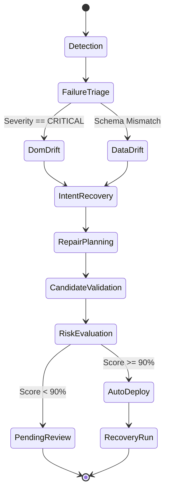

# 🏛️ Software Architecture & Design Patterns Catalog

WebGuardian AI adheres to strict **Clean Code**, **Domain-Driven Design (DDD)**, and classical **Gang of Four (GoF)** design patterns. This document outlines the structural, creational, and behavioral patterns powering the platform.

---

## 1. 🎯 Strategy Pattern
### *Used in: Candidate Selector Generation & Sandbox Scoring*
* **Location**: `apps/backend/app/services/fast_heuristic_engine.py`, `apps/backend/app/services/validation_sandbox.py`
* **Purpose**: Encapsulates distinct algorithms for discovering and validating replacement CSS selectors without coupling the healing engine to a single heuristic.

```text
                  ┌───────────────────────────────┐
                  │      RepairStrategy (ABC)     │
                  ├───────────────────────────────┤
                  │ + evaluate(dom, schema): cand │
                  └──────────────┬────────────────┘
                                 │
         ┌───────────────────────┼───────────────────────┐
         ▼                       ▼                       ▼
┌──────────────────┐   ┌──────────────────┐   ┌──────────────────┐
│ AttributeMatch   │   │  StructuralMatch │   │ SemanticProximity│
│ [data-testid=*]  │   │  .parent > .child│   │ text nearby $    │
└──────────────────┘   └──────────────────┘   └──────────────────┘
```

#### Strategy Implementations:
1. **`AttributeMatchStrategy`**: Matches class-to-data-attribute transitions (`[data-testid='price']`, `[data-test='price']`, `[aria-label*='price']`).
2. **`StructuralMatchStrategy`**: Analyzes DOM hierarchy tree changes (`.product-tile .amount`).
3. **`SemanticProximityStrategy`**: Uses NLP and regex to locate target values (e.g. `$1,299`) and determines the nearest stable CSS parent.
4. **`MemoryRecallStrategy`**: Prioritizes historical high-confidence fixes from `AgentMemory` with >99% success rates.

---

## 2. 🏭 Factory Method Pattern
### *Used in: Multi-Provider LLM & Scraping Infrastructure Abstractions*
* **Location**: `apps/backend/app/services/llm_provider.py`, `apps/backend/app/services/bright_data.py`
* **Purpose**: Decouples business logic from external vendor APIs, allowing seamless hot-swapping between Live Production and Offline Simulation modes.

```python
# Creational Factory for LLM Engine
def get_llm_provider() -> LLMProvider:
    if settings.GEMINI_API_KEY:
        return GeminiProvider(api_key=settings.GEMINI_API_KEY)
    elif settings.OPENAI_API_KEY:
        return OpenAIProvider(api_key=settings.OPENAI_API_KEY)
    return MockProvider()  # Zero-config demo fallback
```

```python
# Creational Factory for Scraping Engine
def get_bright_data_service() -> BrightDataService:
    if settings.BRIGHT_DATA_API_KEY:
        return RealBrightDataService(api_key=settings.BRIGHT_DATA_API_KEY)
    return MockBrightDataService()  # Built-in simulator
```

---

## 3. 🔄 Finite State Machine (FSM) Pattern
### *Used in: LangGraph Autonomous Self-Healing Graph*
* **Location**: `apps/ai_agent/graph.py`
* **Purpose**: Orchestrates deterministic, audit-logged transitions during failure recovery with strictly typed state models (`AgentState`).



---

## 4. 📡 Observer / Publish-Subscribe Pattern
### *Used in: Real-Time SSE Incident War Room Streaming*
* **Location**: `apps/backend/app/services/event_broker.py`, `apps/backend/app/routers/demo.py`
* **Purpose**: Decouples asynchronous background worker execution from active HTTP clients. When the AI agent completes a reasoning node, it emits an event to the broker, which broadcasts it over Server-Sent Events (SSE) to connected browsers.

```text
┌─────────────────┐       publish(run_id, event)       ┌─────────────────┐
│ LangGraph Agent │ ─────────────────────────────────> │   EventBroker   │
└─────────────────┘                                    └────────┬────────┘
                                                                │ broadcast
                                                                ▼
                                                       ┌─────────────────┐
                                                       │ Next.js SSE Sub │
                                                       └─────────────────┘
```

---

## 5. 🛡️ Circuit Breaker & Fallback Pattern
### *Used in: Dual-Tier Self-Healing Engine & Safety Guardrails*
* **Location**: `apps/backend/app/services/fast_heuristic_engine.py`, `apps/ai_agent/graph.py`
* **Purpose**: Protects against runaway LLM costs, API rate limits, and unsafe selector deployments.

1. **Tier 1 Fast Heuristics (<100ms)**: Executes deterministic AST search first. If confidence $>95\%$, bypasses slow LLM calls with $0.00 token cost.
2. **Tier 2 LangGraph Reasoning**: Triggered only for complex layout overhauls.
3. **Safety Sandbox Rejection**: If all candidates fail extraction or achieve $<90\%$ schema score, deployment is **blocked** and escalated for human review.

---

## 6. 🗄️ Repository & Unit of Work Pattern
### *Used in: SQLAlchemy Data Layer & Multi-Tenancy*
* **Location**: `apps/backend/app/core/database.py`, `apps/backend/app/models/models.py`
* **Purpose**: Provides clean separation between relational persistence (SQLite/PostgreSQL) and domain logic, ensuring ACID transactions across repair events.
